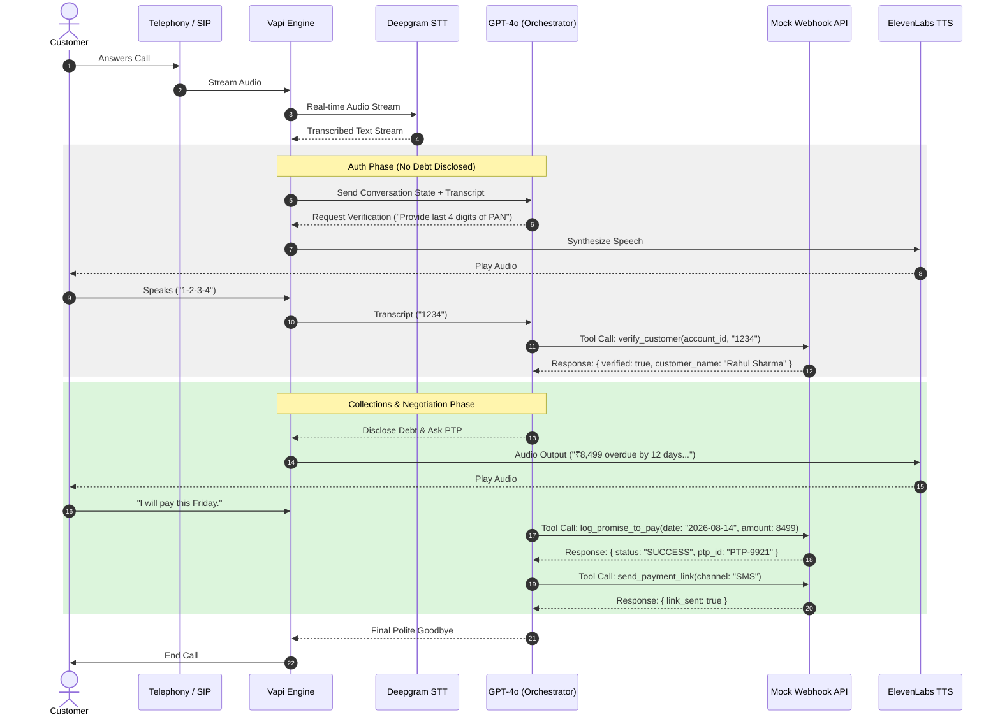

# High-Level Design (HLD) — Kapture Collections Voicebot "Mugilan"

**Client:** Kapture Finance
**Agent name:** Mugilan
**Test customer:** Rahul Sharma — Personal Loan — ₹8,499 overdue — 12 days past due

---

## 1. Architecture & Pipeline

```
Customer Phone
      │
      ▼
Telephony (SIP/PSTN, handled by Vapi)
      │
      ▼
Deepgram Nova-2 (Speech-to-Text)
      │
      ▼
GPT-4o Orchestrator (via Vapi) ── calls ──► Mock Webhook API (Express/Node.js)
      │                                            (verify_customer, log_promise_to_pay,
      │                                             send_payment_link, escalate_to_agent,
      │                                             mark_disposition)
      ▼
ElevenLabs / Cartesia (Text-to-Speech)
      │
      ▼
Telephony Output → Customer Phone
```

### Latency budget (target: under 1.2 seconds round-trip)

| Hop | Component | Target latency |
|---|---|---|
| 1 | STT (Deepgram Nova-2) | ~200 ms |
| 2 | LLM first byte (GPT-4o) | ~400 ms |
| 3 | TTS synthesis (ElevenLabs/Cartesia) | ~300 ms |
| 4 | Network overhead (telephony + tool webhook round trip) | ~200 ms |
| **Total** | | **~1.1s (under 1.2s target)** |

If a tool call (e.g., `verify_customer`) is slow, Mugilan should use a
short filler phrase ("Give me one second...") rather than going silent —
silence over 1.5–2s reads as a dropped call to most users.

---

## 2. Conversation State Machine

States: `INIT → AUTH_PENDING → AUTHENTICATED → NEGOTIATION → PTP_COLLECTED / ESCALATED → CALL_ENDED`

| State | Entry condition | What's allowed | Exit condition |
|---|---|---|---|
| `INIT` | Call connects | Greeting, confirm identity of person on the line | Customer confirms/denies being Rahul |
| `AUTH_PENDING` | Confirmed target person is on the line | Ask for PAN last-4 or birth year. **No debt terms allowed.** | `verify_customer` tool called |
| `AUTHENTICATED` | `verify_customer` returns `verified: true` | Reveal amount, DPD, ask intent | Customer states intent |
| `NEGOTIATION` | In `AUTHENTICATED` state, intent captured | Branch: PTP / already-paid / hardship / dispute / DNC | A resolution tool is called |
| `PTP_COLLECTED` / `ESCALATED` | Resolution tool succeeds | Confirm outcome to customer | Move to closing |
| `CALL_ENDED` | `mark_disposition` called | — | Terminal state |

**Hard rule (state-enforced, not just prompt-suggested):** the transition
from `AUTH_PENDING` → `AUTHENTICATED` is locked behind a successful
`verify_customer` tool response. The model is explicitly instructed it
cannot "assume" verification from tone or claimed identity alone — this is
the single most important compliance control in the whole system, since it
prevents debt disclosure to a wrong/third-party listener.

---

## 3. Intents & Entities

**Intents:**
- `Confirm_Identity`
- `Promise_To_Pay`
- `Hardship_Claim`
- `Dispute_Debt`
- `Already_Paid`
- `Request_DNC`
- `Wrong_Person`

**Entities extracted:**
- `PTP_Date` (ISO-8601, e.g. `2026-08-14`)
- `PTP_Amount` (number)
- `Hardship_Reason` (free text)
- `Verification_Code` (string — PAN last-4 or birth year)

---

## 4. Tool / API Specifications

| Tool | Purpose | Key inputs | Key outputs |
|---|---|---|---|
| `verify_customer` | Confirms caller identity before any disclosure | `account_id`, `verification_code` | `verified` (bool), `message` |
| `log_promise_to_pay` | Records agreed payment date/amount | `account_id`, `ptp_date`, `amount` | `success`, `ptp_id` |
| `send_payment_link` | Sends payment link via SMS/WhatsApp | `account_id`, `channel` | `success`, `message` |
| `escalate_to_agent` | Hands off hardship or dispute cases to a human | `account_id`, `reason` | `success`, `ticket_id` |
| `mark_disposition` | Logs the final outcome of the call | `account_id`, `status`, `notes` | `success`, `disposition_logged`, `timestamp` |

Full JSON Schemas: see `vapi/tool_definitions.json`.

---

## 5. Auth & Data Safety Protocols

- **Zero debt disclosure before verification.** Words like "overdue,"
  "loan," "EMI," "amount," or "Kapture Finance debt" are forbidden in the
  system prompt until `verify_customer` returns `verified: true`.
- **PII masking in logs:** names are logged as `Rahul S****`, not in full.
  Verification codes are never written to logs in plaintext.
- **No debt disclosure to third parties:** if the person answering isn't
  Rahul, Mugilan only asks when Rahul will be available — never mentions
  why he's being called.

---

## 6. Compliance & Guardrails

- Calling window enforced: **08:00–19:00 local time only** (enforced at the
  dialer/campaign level, not just in-prompt).
- Mugilan must self-disclose identity and purpose ("This is Mugilan calling
  from Kapture Finance regarding your account") once past the wrong-number check.
- No threats, no harassment, no raised tone — tone is fixed as "calm, firm, supportive, respectful."
- Hallucination guardrail: Mugilan cannot offer a waiver, discount, or
  settlement greater than 10% without escalating to a human agent.
- Immediate opt-out: a do-not-call request is honored instantly, logged,
  and the call ends — no further negotiation attempts.

---

## 7. Edge Cases Matrix

| Edge case | Expected behavior |
|---|---|
| Abusive user | 1 calm warning → soft hangup with disposition logged |
| Silence / voicemail | 2 re-prompts, then hangup with `NO_RESPONSE` disposition |
| Mid-call language switch (EN ↔ HI) | Mugilan follows the switch naturally, keeps extracting entities correctly in either language |
| Wrong number | `mark_disposition(status="WRONG_PERSON")`, no debt info shared, polite close |
| Already paid | Ask for date/mode of payment → `mark_disposition(status="ALREADY_PAID")` → explain 24–48h processing time |
| Dispute | Empathetic acknowledgment → `escalate_to_agent(reason="DISPUTE")` |
| Do-not-call | Immediate compliance → `mark_disposition(status="DO_NOT_CALL")` → end call |

---

## 8. Observability Metrics

| Metric | Definition | Why it matters |
|---|---|---|
| **Containment Rate** | % of calls resolved without human escalation | Measures automation efficiency |
| **PTP Rate** | % of calls ending in a valid Promise-to-Pay | Core business KPI |
| **First Call Resolution (FCR)** | % of calls ending with a valid disposition logged (not dropped/unresolved) | Measures reliability |
| **Average latency per turn** | Time from customer stops speaking → Mugilan starts speaking | Direct proxy for call quality/naturalness |
| **Drop rate** | % of calls that end abnormally (silence timeout, disconnect) | Flags pipeline or prompt issues |

---

## Appendix: Sequence Diagram (Mermaid.js)


